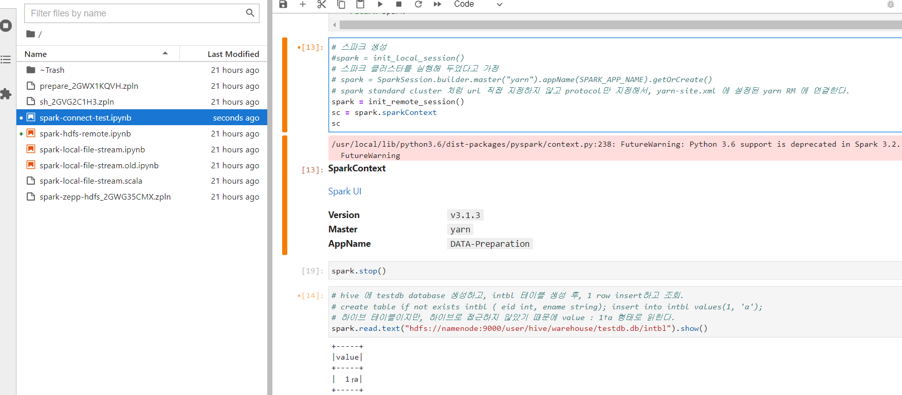

# spark

- Spark, Hadoop, [Hive], python, jupyter lab  
- spark standalone cluster  
  
This project is aim for creating spark exercise environment and making spark getting-started guide which is able to run purely within this project.  

### Pre-requisite

- Ubuntu 18.04 (docker)
- RAM >= 8 GB  

### 실행  
[Spark Cluster + Hdfs + Hive manual installation](docker/hdfs-cluster/Readme.md).  

```bashcd 
/spark-git/spark/docker/hdfs-cluster/cluster-shell;./cluster-up.sh init   
```

---  
 
# 실행 순서  
이 프로젝트는 아래와 같은 순서로 진행합니다.  
0. 테스트 머신 준비  
1. (개발환경 준비 : code-server)
2. 실행 환경 준비 : docker, docker-compose    
3. hdfs + hive + spark cluster 준비   
4. cluster 실행(spark cluster 실행) 
5. 개발 목적에 맞는 IDE 실행 (jupyter lab)  
  
- 클러스터 생성 및 실행  
```bash
# vm 생성 후, 최초 1회  
mkdir /spark-git;cd /spark-git
git clone https://github.com/shwsun/spark.git 
## /hdfs/dn01 ~ dn03 volume mount  

# 실행 시, 매 번  
# hdfs/yarn/hive/spark cluster 실행 쉘이 존재하는 경로로 이동
# cd /spark-git/spark/docker/hdfs-cluster/cluster-shell  
# # 클러스터 환경 생성 
# ./cluster-up.sh init 
cd /spark-git/spark/docker/hdfs-cluster/cluster-shell;./cluster-up.sh init  
# # rproxy 실행 
# cd /spark-git/spark/docker/rproxy 
# docker run -it --name rproxy --net hdfs-cluster_default -p 80:80 -d nginx  
# docker cp default.conf rproxy:/etc/nginx/conf.d/default.conf
# docker exec --privileged -u root -it rproxy nginx -s reload
# hadoop, spark master/slave nodes 실행  
cd /spark-git/spark/docker/hdfs-cluster/cluster-shell 
./run-all.sh init 
# Spark cluster 실행. 'restart-all.sh' 실행하면 ssh 연결이 가능해져서 전체 spark node 한번에 실행 가능.  
# 향후, restart-all.sh 에 통합할 예정  
# docker exec -it spark-master bash -c "/install-files/run-spark.sh"
# docker exec -it spark-master jupyter server list
```
  
# 0. 테스트용 머신 준비  
여기에서는 편의상 VM 또는 1 대의 머신에 여러 대의 container로 분산 환경을 구성합니다.  
여러 대의 머신을 확보해서 분산환경을 구성하려면, 이 샘플의 container 각각에 실행하는 과정을 머신에서 직접 수행하면 됩니다.  
    
Virtualbox(vagrant)나 GCP를 이용해 machine을 준비하는 과정을 설명합니다.  
실행해 볼 수 있는 machine을 이미 준비해 둔 경우에는 이 단계는 생략합니다.  
준비 과정은 각각 [`host-vm`], [`gcp`] 부분에서 자세하게 설명합니다.  
> ... 작성 중 ...  
  
--- 

# 1. Code-Server 설치하기  
개발환경 설치 과정을 소스 코드로 관리하기 위해(Infrastructure as Code) `code-server`를 설치하고, 여기에서 설치 프로젝트를 진행할 예정입니다.   
설치 과정이 필요하지 않고, 클러스터를 실행해 보기만 하려는 경우에는 `code-server`는 설치할 필요가 없습니다.  
code-server의 terminal과 소스 편집창을 오가며 작업할 예정이라, code-server를 container로 설치하지 않고, baremetal 로 설치했습니다. 
code-server 터미널에서 실행한 여러가지 종류의 설치 명령이, container 내부가 아닌 머신에서 실행되어야 하는 경우가 더 많기 때문입니다.  
     
GCP 에서 VM 을 생성해 사용하는 경우, GCP SSH 콘솔이나 명령창에 연결해서 아래와 같이 실행합니다.  
```bash
# 코드 서버 설치 파일 다운로드 및 설치  
sudo -i
curl -fsSL https://code-server.dev/install.sh | sh
```
코드서버가 정상 작동하는 지 실행하기 위해 실행해 봅니다.  
```bash
code-server > /dev/null 2>&1 &
# 아래와 같이 코드 서버 설정을 확인할 수 있습니다. 
cat ~/.config/code-server/config.yaml
```
  
머신을 시작하면 바로 코드 서버가 실행되도록 서비스로 등록합니다.  
  
지정한 포트로 실행하고 외부 접속을 허용하기 위해 아래와 같이 설정을 변경하고 서비스로 등록합니다.   
코드서버 포트가 GCP 방화벽에 열려 있어야 합니다.  
```bash
sudo -i
# code-server 용 config 파일 생성  
cat <<EOF |tee ~/.config/code-server/config.yaml
bind-addr: 0.0.0.0:8888
auth: password
password: <password_you_want>
cert: false
EOF

# 기존 코드 서버 실행 프로세스 죽이기
kill -9 ...
# 서비스 등록 
systemctl enable --now code-server@$USER
# you can connect to it using http://<your ip>:8888 
```
  
---
# 2. 실행 환경 준비 : docker  
클러스터 환경을 docker, docker-compose를 이용해 구성했습니다.  
클러스터를 실행하기 위해서는 docker, docker-compose를 설치해야 합니다.  
docker-compose가 낯선 경우, docker를 차례대로 실행하면 됩니다.  
  
## Docker 설치  
Docker 환경 설치는 아래와 같이 진행합니다.  
```bash
sudo -i
apt-get update  
apt-get install -y ca-certificates curl gnupg lsb-release
curl -fsSL https://download.docker.com/linux/ubuntu/gpg | sudo gpg --dearmor -o /usr/share/keyrings/docker-archive-keyring.gpg
# 아래 문장은 줄바꿈 없이 한 줄로 이루어진 명령. 웹 복사시 줄바꿈 들어가 있으면, 줄바꿈 없애야 함.  
echo "deb [arch=$(dpkg --print-architecture) signed-by=/usr/share/keyrings/docker-archive-keyring.gpg] https://download.docker.com/linux/ubuntu $(lsb_release -cs) stable" | sudo tee /etc/apt/sources.list.d/docker.list > /dev/null
apt-get update
apt-get install -y docker-ce docker-ce-cli containerd.io
```
## Docker-compose 설치  
```bash
sudo curl -L "https://github.com/docker/compose/releases/download/1.29.2/docker-compose-$(uname -s)-$(uname -m)" -o /usr/local/bin/docker-compose
sudo chmod +x /usr/local/bin/docker-compose
```
  
---  
# 3. hdfs + hive + spark cluster 준비  
`hdfs-cluster` 경로에 준비해 둔 docker-compose를 실행하면, hadoop + spark cluster 환경이 실행 됩니다.  
환경 실행 전/후에 처리할 일들을 묶어서 실행 스크립트로 만들어 두었습니다.  
스크립트를 순서대로 실행하면, cluster를 실행하고 사용할 수 있습니다.  
```bash
#cd /spark-git/spark/docker/hdfs-cluster/cluster-shell 
./cluster-up.sh 
```
  
# 4. 클러스터 실행  
설치가 끝난 클러스터에서 ssh 연결, namenode format, hive schema 생성, spark 실행 및 hue 실행을 진행한다.  
아직 spark 실행 부분은 작성 중...  
  
- 클러스터 생성 및 실행  
```bash
# mysql data를 도커 재실행시에도 유지하려고 /data/mysql 볼륨을 공유. 미리 생성해 두어야. 
mkdir -p /data/mysql
# hdfs/yarn/hive/spark cluster 실행 쉘이 존재하는 경로로 이동
cd /spark-git/spark/docker/hdfs-cluster/cluster-shell  
# 최초 실행시, hive&hue db 생성(초기화) 및 namenode format을 진행해야 할 경우 명령에 init 옵션을 추가. 
# 클러스터 환경 생성 
./cluster-up.sh init
# hadoop, spark master/slave nodes 실행  
./run-all.sh init
```
  
# 5. IDE 연결  
Hue를 연결하거나, Jupyter 를 실행해 Spark 개발환경에 연결한다.  
Hue 는 Jupyter 보다 편집은 불편하지만, hive 등 다른 환경과 통합되어 있어서 편한 점이 장점이다.  
Hue는 pyspark, Livy interactive 환경을 설치하고, Jupyter는 원격 연결 방식으로 설치해서 사용할 예정.  
  
> 주피터 실행 전에 명령창에서 pyspark로 스파크 실행이 가능한 상황 확인해야 함.  
> 이 환경 유지한 상태로 jupyter를 실행해야 함. 
> 주피터에서 pip install pyspark로 설치하는 pyspark는 spark 사용하기 위한 API 일 뿐.  
> spark session 연결 시에는 외부 환경에 설정된 pyspark 실행 환경이 로드되어야 한다.  
  
아래와 같이 `spark-master` node 에서 실행한 jupyter 노트북에서 spark session을 연결해서 실행할 수 있다.  
  


  