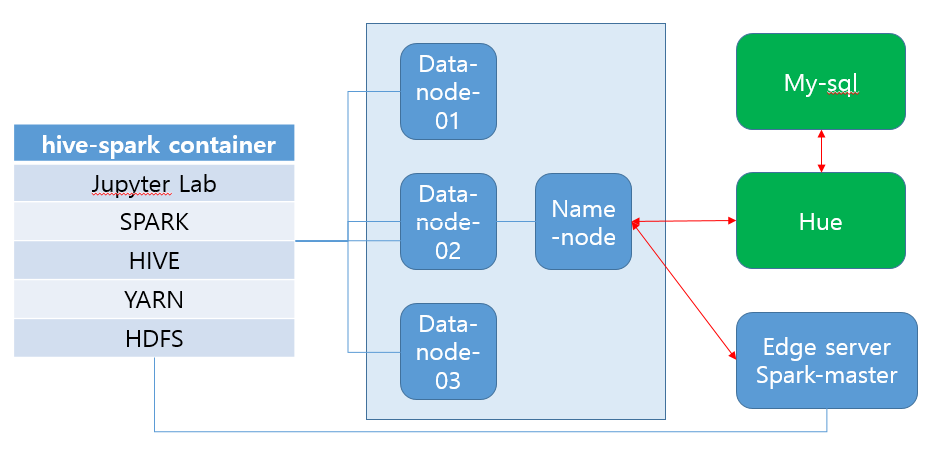
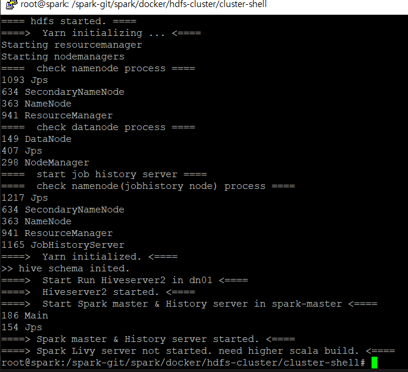
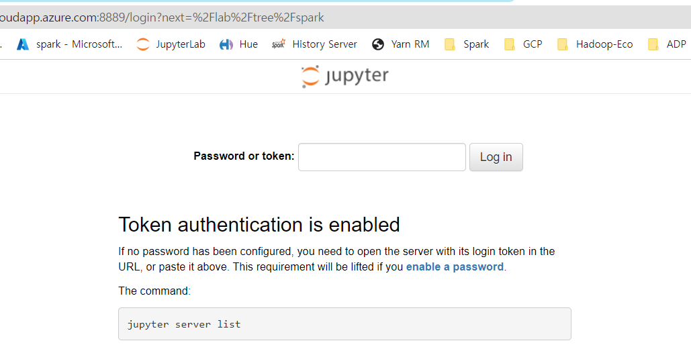
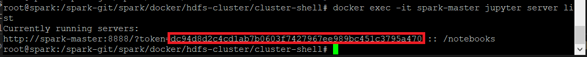
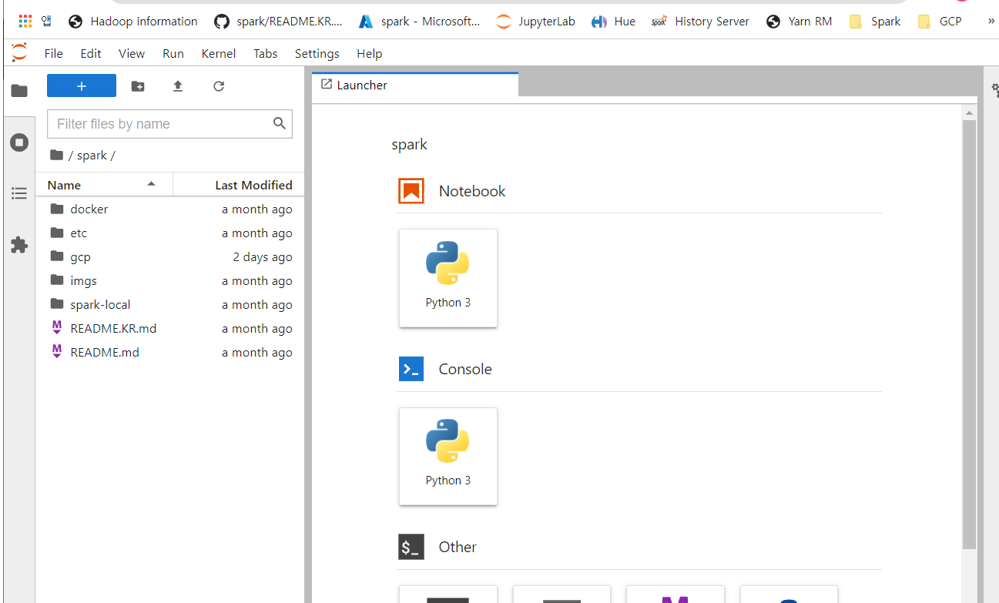
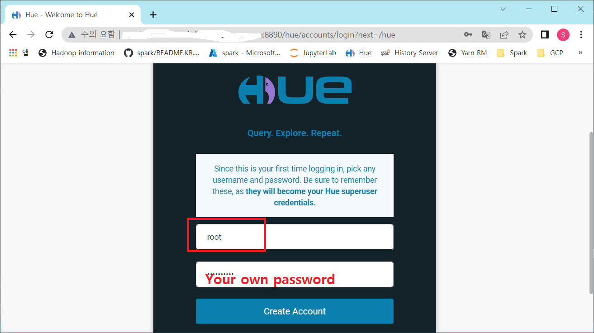
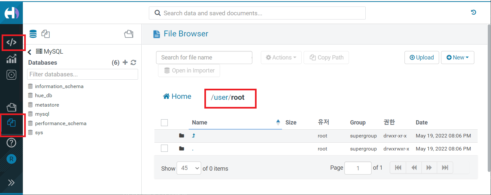

# Spark cluster + hdfs(hive) + Hue  
This project consists of hadoop, hive, mysql, hue, spark and jupyter-lab.  
In this cluster 7 machines(vm) are created using 'docker-compose.yml'.  
  
  
- run cluster  
- connect to pyspark IDE(jupyter notebook)
- connect to Hue Web UI  
- develop pyspark application 
- run pyspark app in jupyter and monitoring spark app  
- submit pyspark app    
  
---   
## run cluster  
You can run this cluster like belows.  

```bash
# with root privilege  
# sudo -i  
# '/spark-git/spark' is root of this project. 
# move into 'spark/docker/hdfs-cluster/cluster-shell' and then run cluster-up shell with init option  
# init option initialize hive meta-store.  
cd /spark-git/spark/docker/hdfs-cluster/cluster-shell;./cluster-up.sh init 
```  
   

Now Hadoop + Spark cluster creation is all completed.  
  
---  
## connect to pyspark IDE  
After cluster creation completed, you can connect to spark-client notebook(juypter lab).  
Because I'm familliar with 'python' when using Spark, I launched 'Jupyter Notebook(Lab)'.  
- http://<your machine address(not docker-container address)>:8889/   
    
You can get jupyter's token using below command.  
```bash
# because your juypter notebook is run in docker container. 
# you can get token in docker.  
# using below command connect to spark-master docker and run 'jupyter server list' command in docker.  
# and then print that result (jupyter server token)
docker exec -it spark-master jupyter server list  
```
  
   
  
## connect to Hue Web UI   
And also you can use 'Hue'. 
With this tool you can code and browse hdfs/hive/spark/mysql.  
At this time, in this project's 'Hue' there's 3 editors, but only 'mysql' editor work correctly.  
Later I'll correct 'Hue' setting and make other editore work correctly.  
  
At first time you must create user 'root'.  
With 'root' account type your own password and then create this account.  
You must create 'root' account because in this container several things are setted with 'root' account.  
    

In Hue I'm gonna use 'Files(HDFS web browser)' and 'Editor > MySQL'. 
   
