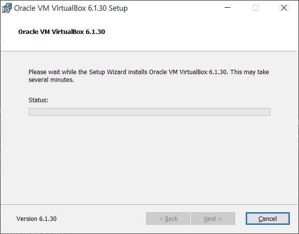
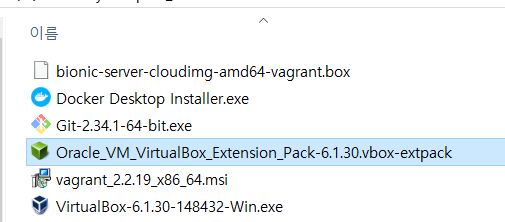
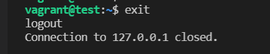
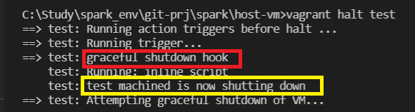

# 테스트용 VM 구성  
exercise 환경을 구성할 ubuntu 머신이 없는 경우, 아래와 같이 ubuntu vm을 생성해 사용(Windows OS 사용자)  
vagrant + virtualbox + ubuntu  
- VirtualBox-6.1.30-148432-Win.exe [](https://download.virtualbox.org/virtualbox/6.1.30/VirtualBox-6.1.30-148432-Win.exe) 
- vagrant_2.2.19_x86_64.msi [vagrant 2.2.19 다운로드 경로](https://www.vagrantup.com/downloads) 
- Oracle_VM_VirtualBox_Extension_Pack-6.1.30.vbox-extpack [](https://download.virtualbox.org/virtualbox/6.1.30/Oracle_VM_VirtualBox_Extension_Pack-6.1.30.vbox-extpack) 
- bionic-server-cloudimg-amd64-vagrant.box [Ubuntu:bionic 다운로드 경로](https://app.vagrantup.com/ubuntu/boxes/bionic64)  
  
1. virtualbox 설치  
2. virtualbox extension 설치(생략 가능)  
3. vagrant 설치(설치 후 재시작 필요)  
4. Register ubuntu image to virtualbox(ubuntu virtualbox 용 image를 vagrant cache에 등록)  
5. Create 'test' vm & run  
  
---  

## 1. Virtualbox install  
  
  
## 2. Virtualbox Extension pack install  
  
  
  
## 3. Vagrant install  
 

## 4. Register ubuntu image to virtualbox  

다운받은 ubuntu:bionic image를 vagrant cache에 추가  
베이그런트에 한번 등록해 두면 내부 캐쉬에 저장되서 이후에는 이름으로 바로 호출 가능.
매 번 다운로드 받아서 등록해 줄 필요 없음.  
단, 베이그런트 완전 삭제시에는 캐쉬가 사라지므로 이미지 파일을 다시 등록해야 사용 가능.  
  
ubuntu box를 다운받은 경로로 이동해서 아래와 같은 명령으로 ubuntu virtualbox image 등록  
```bash
# run below command in which .box file is located 
vagrant box add ubuntu bionic-server-cloudimg-amd64-vagrant.box
``` 
 
  
## 5. Create `test` vm & run  
### add vm setting in `Vagrantfile` 
virtualbox에 직접 설정해도 되지만, 자동화 및 설정의 재현을 위해(Infrastructure as Code) `Vagrant` script를 이용해 VM을 생성한다.  
`Virtualbox` 및 `Vagrant`가 정상적으로 설치되었는 지 확인하기 위해 간단한 `Ubuntu` vm을 `test`라는 이름으로 생성해 본다.  
아래와 같이 `Vagrantfile`에 스크립트를 추가해서 RAM 2 G, CPU 2 core, IP '192.168.56.10'인 VM 을 생성할 수 있다.  
```ruby
Vagrant.configure("2") do |config|
    # config.vbguest.auto_update = false
    # test linux 
    config.vm.define "test" do |vname|
        vname.vm.box = "ubuntu"
        vname.vm.hostname = "test"
        vname.trigger.before :halt do |trigger|
            trigger.warn = "graceful shutdown hook"
            trigger.run_remote = {inline: "echo 'test machine now shutting down'"}
        end
        vname.vm.provider "virtualbox" do |vb|
            vb.name = "test"
            vb.customize ['modifyvm', :id, '--audio', 'none']
            vb.memory = 2000
            vb.cpus = 2
        end
        vname.vm.network "private_network", ip: "192.168.56.10"
    end
end  
```  
  
파일 생성 후, `Vagrantfile`이 위치한 경로에서 `vagrant xxx`와 같은 명령으로 vm 에 생성/실행/정지/기타등등을 지시할 수 있다.  
### test vm run  
```bash
# assume that 'Vagrantfile' already prepared
# change directory to vagrant root in which folder 'Vagrantfile' exist. (./spark/host-vm)  
# cd <vagrant root>
vagrant up test
```
아래와 같이 vagrant script 가 실행되는 로그가 출력되면 'test' ununtu machine(vm)이 정상적으로 booting 된 것이다.  
  
  
  

  

  

  


